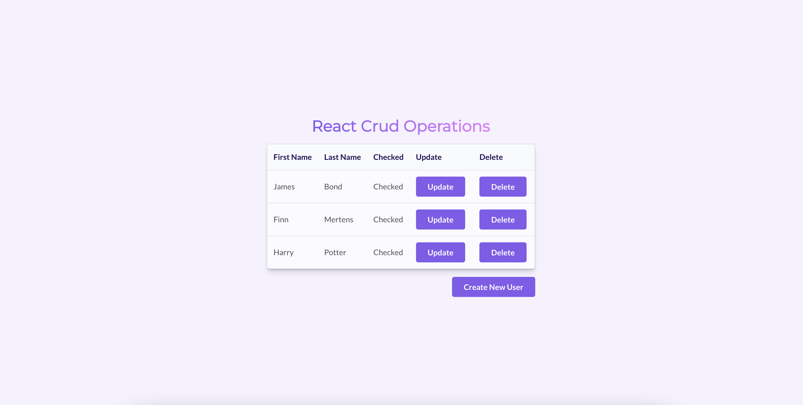
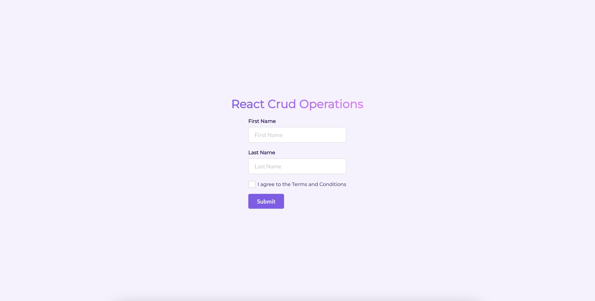
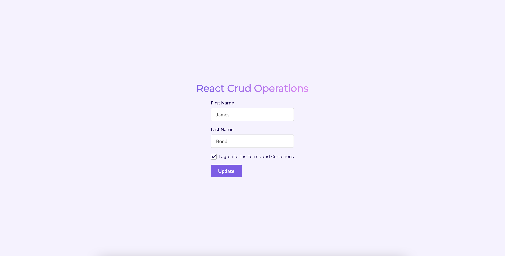

# Getting Started with the Crud Project

This project was built using React and acts to reinforce CRUD functionality within an app. It incorporates use of [Semantic UI](https://semantic-ui.com/) to support styling as well as [Mock API](https://mockapi.io/) to facilitate CRUD functionality quickly without the need to build a backend and database.

## To Get Started

Due to its current functionality, the project has not been deployed as a live app. In order to view, the repository should be cloned and run in a local environment:

- Clone the repository, following GitHub instructions that are suited to your environment/preferences
- Once cloned, navigate to the project directory and run `npm install`
- Then `npm start` to run the app in development mode. This will open [http://localhost:3000](http://localhost:3000) to view it in your browser.
- Navigate to [http://localhost:3000/read](http://localhost:3000/read)

### Read Page

### Create Page

### Update Page

### `npm test`

Launches the test runner in the interactive watch mode.\
Testing has not yet been setup. Further updates to be added to the test suite.
